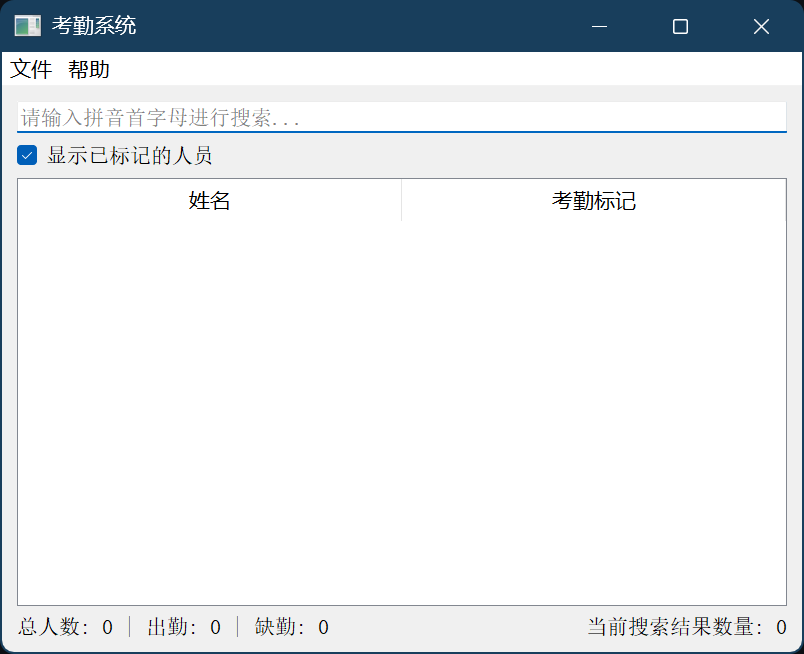

# Check-the-list-applet
这是一个根据提供的csv格式名单进行快速点名的python小程序，点名完成后你可以将结果导出。


# 为什么开发这个软件？

每当自己点名，核对名单时都想有一款可以提高点名效率的软件。一般是使用excel进行人名查找，但是带来的问题是excel不支持首字母查找，更不支持模糊查找。这就要求你必须将名字完整打出或者部分打出才可以进行搜索，这无疑是十分低效的。

所以为了提高点名的效率，便在chatgpt的帮助下迅速地开发出来了这个可以动态查询人名首字母的小程序，并添加了数字快捷键1-9快速选择人名，让用户基本可以完全使用键盘操作。
# 适用场景
统计谁没交作业
# 特点

- 1-9数字快捷键，快速选择
- 实时显示搜索结果
- 拼音首字母查询，并支持多音字
- 实时统计当前查询数据量，总体情况，了解当前进度
- 点名结果可以导出
# 使用方法

1. 通过'文件'菜单导入名单(CSV文件格式)。
```CSV
张三
李四
王五
```
2. 使用输入框输入拼音首字母进行搜索，支持多音字。
```commandline
zs
ls
ww
```
3. 勾选'显示已标记的人员'可以查看所有人员，包括已标记的。
4. 可以通过'导出考勤情况'按钮将考勤记录保存为CSV文件。
快捷键使用方法:
- 在搜索框中按下回车键可以切换唯一匹配人员的出勤状态。
- 按数字键1-9可以快速切换对应位置人员的出勤状态。


# 待改进的地方
1. 目前仅仅适合小范围内点名，对于重名问题没有考虑到，因为只支持单列名单，后续可以考虑加入学号列以辅助查询。
2. 添加一个点名进度条，查看当前进度
3. 考虑更换tk框架而不是使用qt框架以减少程序大小。
4. 当前进度无法保存，提供保存按钮，实时保存当前的工作进度
5. 